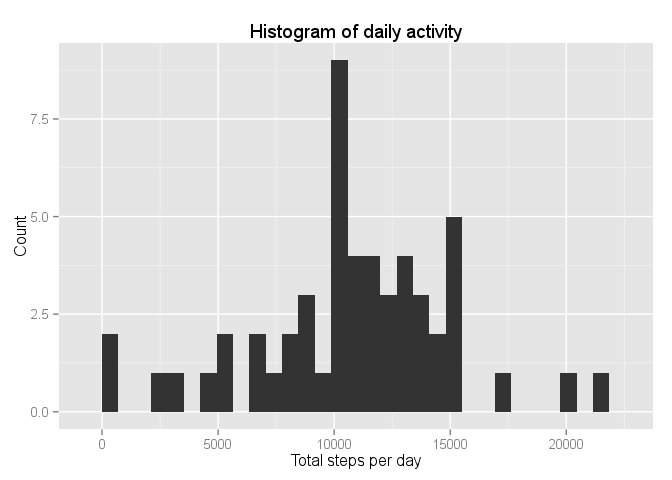
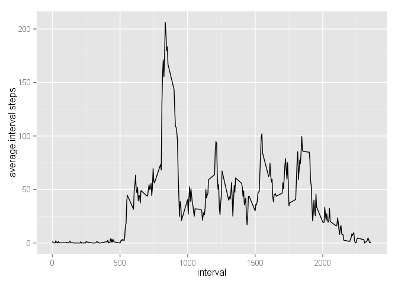
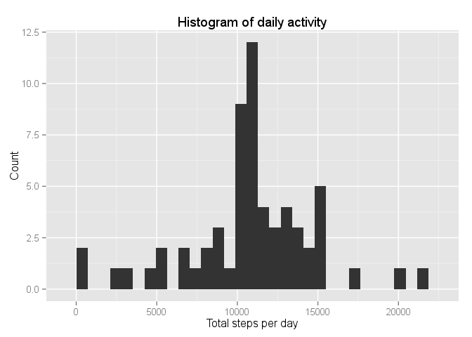

# Reproducible Research: Peer Assessment 1
## Preparatory steps
The additional libraries ```dplyr```, ```ggplot2``` and ```lubridate``` are used and must therefore be loaded.

```r
library('dplyr')
```

```
## 
## Attaching package: 'dplyr'
## 
## The following object is masked from 'package:stats':
## 
##     filter
## 
## The following objects are masked from 'package:base':
## 
##     intersect, setdiff, setequal, union
```

```r
library('ggplot2')
library('lubridate')
```

## Loading and preprocessing the data
The first step is to extract the activity.csv file from the already downloaded (as the git repository was cloned) zip archive and to get rid of missing values.

```r
unzip('activity.zip')
activity  <- read.csv('activity.csv')
activity.filtered  <- filter(activity, !is.na(steps))
str(activity.filtered)
```

```
## 'data.frame':	15264 obs. of  3 variables:
##  $ steps   : int  0 0 0 0 0 0 0 0 0 0 ...
##  $ date    : Factor w/ 61 levels "2012-10-01","2012-10-02",..: 2 2 2 2 2 2 2 2 2 2 ...
##  $ interval: int  0 5 10 15 20 25 30 35 40 45 ...
```
#### In a second step, datasets are created that include the totals or averages of daily steps as required for the subsequent "per day" and "daily pattern" questions.

```r
activity.daily  <- summarize(group_by(activity.filtered, date), 
                              steps.per.day=sum(steps))
str(activity.daily)
```

```
## Classes 'tbl_df', 'tbl' and 'data.frame':	53 obs. of  2 variables:
##  $ date         : Factor w/ 61 levels "2012-10-01","2012-10-02",..: 2 3 4 5 6 7 9 10 11 12 ...
##  $ steps.per.day: int  126 11352 12116 13294 15420 11015 12811 9900 10304 17382 ...
##  - attr(*, "drop")= logi TRUE
```

```r
average.activity  <- summarize(group_by(activity.filtered, interval), 
                              average.interval.steps=mean(steps))
str(average.activity)
```

```
## Classes 'tbl_df', 'tbl' and 'data.frame':	288 obs. of  2 variables:
##  $ interval              : int  0 5 10 15 20 25 30 35 40 45 ...
##  $ average.interval.steps: num  1.717 0.3396 0.1321 0.1509 0.0755 ...
##  - attr(*, "drop")= logi TRUE
```

## What is mean total number of steps taken per day?
For this question the previously generated ```activity.daily``` dataset is used. First, the corresponding histogram:

```r
g  <- qplot(activity.daily$steps.per.day)
g + labs(title='Histogram of daily activity', 
         x='Total steps per day', y='Count')
```

 

Then it is calculated the mean and median total number of steps taken per day:

```r
mean.activity.daily <- mean(activity.daily$steps.per.day)
print(mean.activity.daily)
```

```
## [1] 10766.19
```

```r
median.activity.daily <- median(activity.daily$steps.per.day)
print(median.activity.daily)
```

```
## [1] 10765
```

## What is the average daily activity pattern?
For this question the previously generated ```average.activity``` dataset is used. First, the time series plot:

```r
g2 <- ggplot(average.activity, aes(x = interval, y = average.interval.steps))
g2 + geom_line()
```

 

The maximum number of steps are walked in the following interval:

```r
#Get a logical vector, detemining if the corresponding interval is the max().
average.activity.max  <- average.activity$average.interval.steps==max(average.activity$average.interval.steps)
max.step.interval <- average.activity[average.activity.max,]
print(max.step.interval)
```

```
## Source: local data frame [1 x 2]
## 
##   interval average.interval.steps
## 1      835               206.1698
```
That is, in interval 835, the maximum number of steps is 206.1698113.

## Imputing missing values
The total number of missing vales (`NAs`) is:

```r
any(is.na(activity))
```

```
## [1] TRUE
```

```r
any(is.na(activity$date), is.na(activity$interval))
```

```
## [1] FALSE
```

```r
NA.steps <- sum(is.na(activity$steps))
print(NA.steps)
```

```
## [1] 2304
```
That is, there are 2304 rows with missing values for the step variable.

The strategy for imputing missing values for these cases is to use the average number of steps taken, averaged across all days for each 5-minute interval, as calculated above.


```r
activity.imputed <- activity
activity.imputed$steps <- ifelse(is.na(activity.imputed$steps) == TRUE, average.activity$average.interval.steps[average.activity$interval %in% activity.imputed$interval], activity.imputed$steps)
activity.imputed <- select(activity.imputed, date,interval,steps)
```

The generated ```activity.imputed``` dataset serves then to produce the corresponding histogram:

```r
activity.imputed.daily  <- summarize(group_by(activity.imputed, date), 
                              steps.per.day=sum(steps))

g  <- qplot(activity.imputed.daily$steps.per.day)
g + labs(title='Histogram of daily activity', 
         x='Total steps per day', y='Count')
```

 

Then it is calculated the mean and median total number of steps taken per day:

```r
mean.activity.imputed.daily <- mean(activity.imputed.daily$steps.per.day)
print(mean.activity.imputed.daily)
```

```
## [1] 10766.19
```

```r
median.activity.imputed.daily <- median(activity.imputed.daily$steps.per.day)
print(median.activity.imputed.daily)
```

```
## [1] 10766.19
```

That is, there are only slight differences occuring from the imputation, as is to be expected: There are only 

```r
nrow(activity.imputed.daily)-nrow(activity.daily)
```

```
## [1] 8
```
days with completely missing values for the steps variable. The resulting difference in mean daily steps is 0, the median differs by 1.1886792 daily steps.

The total number of daily steps for the first part of this assignment is:

```r
sum(activity.imputed.daily$steps)-sum(activity.daily$steps)
```

```
## [1] 86129.51
```
This is simply the number of days with missing values times the mean daily steps value which in effect was imputed.

## Are there differences in activity patterns between weekdays and weekends?
For this question, the dataset with imputed values is still used.
The weekdays are determined by `weekdays()`, not before de-factoring the date variable and parding it using `ymd()`, then serving indicators for the factor variable `weekend`:

```r
activity.imputed <- mutate(activity.imputed, weekdays=weekdays(ymd((as.vector(activity.imputed$date)))))
activity.imputed$weekend <- ifelse((activity.imputed$weekdays %in% c("Samstag","Sonntag")) == TRUE, TRUE, FALSE)
activity.imputed$weekend <- factor(activity.imputed$weekend, levels=c(TRUE,FALSE), labels=c("weekend","weekday"))
activity.imputed <- select(activity.imputed, date:steps,weekend)
```

Next, the time series plot is produced:

```r
average.activity.weekday  <- summarize(group_by(activity.imputed, weekend, interval), 
                              average.interval.steps=mean(steps))

g2 <- ggplot(average.activity.weekday, aes(x = interval, y = average.interval.steps))
p2 <- g2 + geom_line()
p2 + facet_grid(weekend ~ .)
```

 
